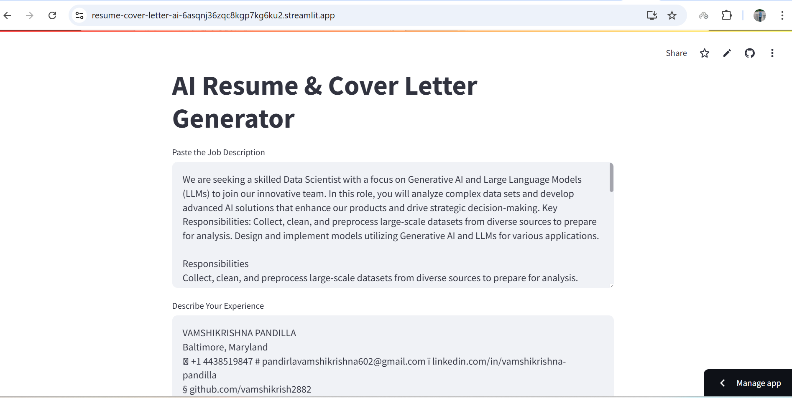
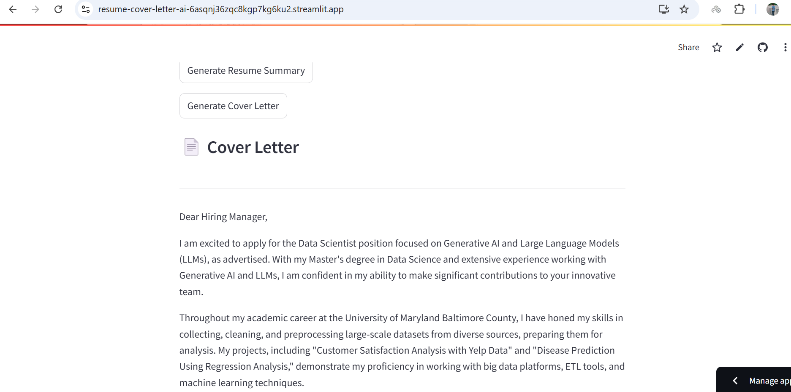

#  AI Resume & Cover Letter Generator
[](https://resume-cover-letter-ai-6asqnj36zqc8kgp7kg6ku2.streamlit.app/)


Generate personalized resume summaries and cover letters using **Generative AI (LLMs)** powered by **Together AI**.

This project helps job seekers quickly craft tailored application materials based on a job description and their own experience — all through a clean and interactive web app.

---
##  Screenshots

Here’s a look at the app in action:

###  1. Enter Job Description and Experience


###  2. Generated Resume Summary / Cover Letter


##  Features

-  Input job description and your experience
-  Get a customized resume summary and cover letter
-  Powered by `Mixtral-8x7B` via Together AI
-  Built with Streamlit for real-time generation

---

##  Tech Stack

- Python
- Streamlit
- Together AI API (`together`)
- `dotenv` for API key management

---

##  Installation & Setup

### 1. Clone the repository

```bash
git clone https://github.com/vamshikrish2882/resume-cover-letter-ai.git
cd resume-cover-letter-ai
